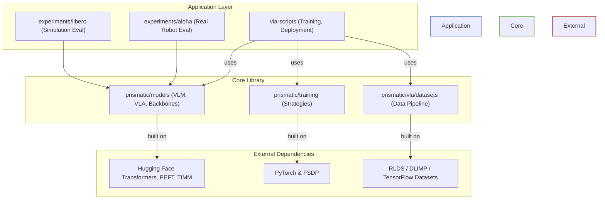
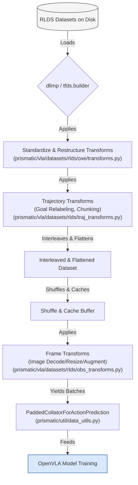
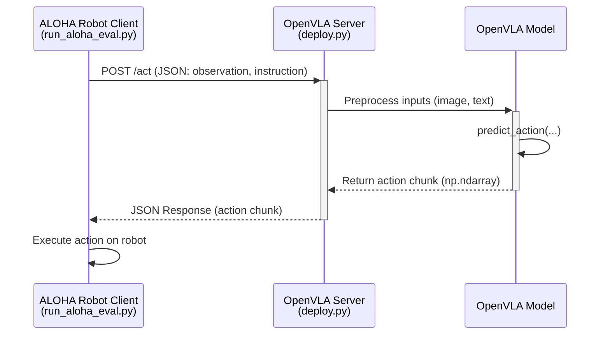
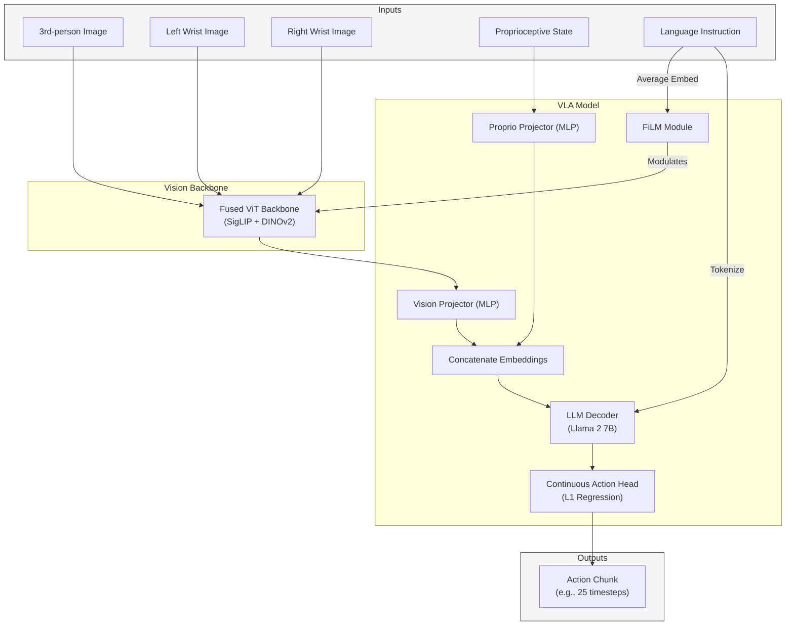

### **I. Understanding and Clarity**

#### **High-Level Overview**

* **System Description & Core Responsibilities:**
    The `openvla-oft` system is a framework for fine-tuning and evaluating Vision-Language-Action (VLA) models on robotics tasks. Its core responsibility is to provide the tools to take a pre-trained Vision-Language Model (VLM), efficiently fine-tune it on robotics datasets (like ALOHA and LIBERO), and deploy it for inference in both simulated and real-world environments.

* **Architectural Diagram & Component Interaction:**
    The system follows a layered architecture that separates core model logic from specific applications.

    ```
    +-------------------------------------------------------------------+
    |      Application Layer (Evaluation & Deployment)                  |
    |  +---------------------+  +------------------+  +---------------+ |
    |  | experiments/libero/ |  | experiments/aloha/ |  | vla-scripts/  | |
    |  | (Sim Evaluation)    |  | (Real Robot Eval)|  | (Training,    | |
    |  +---------------------+  +------------------+  |  Deployment)  | |
    +-------------|--------------------|-------------------|-----------+
                  |                    | (REST API)        |
    +-------------|--------------------|-------------------|-----------+
    |      Core Model & Training Library (prismatic/)                   |
    |  +---------------------+  +------------------+  +---------------+ |
    |  | models/ (VLM, VLA)  |  | training/        |  | preprocessing/| |
    |  +---------|-----------+  +------------------+  +-------|-------+ |
    |            |                                            |         |
    |  +---------|-----------+  +------------------+           |         |
    |  | backbones/ (Vision, |  | action_tokenizer |           |         |
    |  | LLM)                |  +------------------+           |         |
    |  +---------------------+                                 |         |
    +------------------------------------------------------------|-------+
                                                                 |
    +------------------------------------------------------------|-------+
    |      Data Layer (RLDS Datasets)                            |
    |  +--------------------------------------------------------+       |
    |  | vla/datasets/rlds/ (TFDS/DLIMP Pipeline)               |       |
    |  +--------------------------------------------------------+       |
    +-------------------------------------------------------------------+
    ```

  * **`prismatic/`**: This is the core library containing the model definitions. It is agnostic to specific robots or tasks.
    * `models/backbones`: Defines the unimodal components (Vision Transformers, LLMs).
    * `models/vlms`: Defines the general-purpose `PrismaticVLM`.
    * `models/vlas`: Defines `OpenVLA`, a specialized wrapper for robot action prediction.
    * `training/`: Contains logic for different distributed training strategies (FSDP, DDP).
    * `preprocessing/` & `vla/datasets/`: Handles data loading, primarily using the RLDS format via TensorFlow/DLIMP.
  * **`vla-scripts/`**: These are high-level scripts that use the `prismatic` library to perform key workflows like `finetune.py` and `deploy.py`.
  * **`experiments/`**: This layer contains the application-specific code for evaluating the VLA models on different robotics benchmarks (`libero` for simulation, `aloha` for a real robot).

* **Architectural Rationale:**
    The primary architectural choice is the **separation of concerns** between the generic model (`prismatic`) and its specific applications (`experiments`, `vla-scripts`). This makes the system highly modular and extensible. Building on top of established libraries like Hugging Face `transformers`, `timm`, `peft`, and `dlimp` leverages the strengths of the open-source ecosystem, avoiding reinvention and ensuring access to state-of-the-art components. The use of a client-server model for real-robot deployment (`deploy.py` server, `run_aloha_eval.py` client) is a key decision that decouples the high-resource model inference from the low-latency robot control loop.

#### **Component Deep Dive**

Let's deep-dive into a key component: `prismatic.models.vlas.openvla.OpenVLA`.

* **Purpose:** `OpenVLA` is the main class that functions as the robot policy. It wraps the more general `PrismaticVLM` and adds functionality specific to robotics, most notably the ability to discretize and de-discretize continuous action vectors.
* **Inputs:** For its primary inference method, `predict_action`, it takes a PIL Image and a string instruction.
* **Outputs:** It outputs a continuous NumPy array representing the predicted robot action.
* **Dependencies:** It has a direct dependency on `PrismaticVLM`, an `ActionTokenizer`, and the normalization statistics (`norm_stats`) from the training dataset.
* **Module Organization:** The system's modules are well-organized. For example, the `prismatic/models` directory is logically divided into `backbones` (the fundamental building blocks), `vlms` (the general vision-language models), and `vlas` (the specific action-prediction models). This hierarchical structure makes the codebase easy to navigate.
* **Communication Mechanisms:**
  * **Internal:** Within the `prismatic` library, communication is done via standard Python class instantiation and method calls.
  * **External (Deployment):** For the ALOHA robot, communication is handled via a REST API. The `run_aloha_eval.py` script acts as a client, sending HTTP POST requests with observation data to a FastAPI server started by `deploy.py`. This is an effective way to handle remote inference.
* **State Management:** The primary state is the model's weights. During training, this state is managed by the chosen `TrainingStrategy` (e.g., FSDP) and periodically saved to checkpoints. During inference, the model is stateless, processing each observation independently.

#### **Information Flow**

Let's trace an action prediction request during a real-robot ALOHA evaluation:

1. **Observation:** The client script `run_aloha_eval.py` captures images and proprioceptive data from the robot hardware.
2. **HTTP Request:** It packages the observation and a string instruction into a JSON payload and sends it via an HTTP POST request to the `/act` endpoint of the server running `deploy.py`.
3. **Server-Side Preprocessing:** The `OpenVLAServer` receives the request. The `get_vla_action` function uses the `AutoProcessor` to transform the raw image array into a normalized `torch.bfloat16` tensor and tokenizes the text prompt.
4. **Model Inference:** The preprocessed inputs are passed to `vla.predict_action`. This method internally runs the full forward pass through the vision backbone, projector, and LLM to generate a sequence of discrete action tokens.
5. **Action De-Tokenization:** The `ActionTokenizer` converts these discrete token IDs back into a normalized, continuous action vector.
6. **Action Un-Normalization:** The model uses its stored `norm_stats` to un-normalize the action, converting it to the robot's native action space.
7. **HTTP Response:** The final continuous action is sent back to the client as a JSON response.
8. **Execution:** The client script `run_aloha_eval.py` receives the action and commands the robot hardware.

Data is validated implicitly through type hints and the strict input requirements of the underlying libraries (`torch`, `transformers`). Error handling on the server is managed by a general `try...except` block that returns an error message, which is suitable for a research environment.

### **II. Maintainability and Evolution**

* **Modularity and Cohesion:** The codebase exhibits high modularity and cohesion.
  * Components have well-defined responsibilities. For instance, `prismatic/models/action_heads.py` is solely responsible for defining different continuous action prediction heads (L1, Diffusion), separate from the core VLM.
  * One can easily modify a single component, such as the ALOHA evaluation logic, without impacting the core model definitions in `prismatic`.
  * Common concerns are handled centrally. The `prismatic/overwatch` module provides a consistent logging interface used throughout the system.

* **Loose Coupling:** Components are loosely coupled.
  * The evaluation scripts (`experiments/`) interact with the VLA model through a clear, high-level API (`predict_action`), decoupling them from the model's internal implementation details.
  * There are no apparent circular dependencies; the dependency graph flows from application (`experiments`) to the core library (`prismatic`).

* **Extensibility and Adaptability:** The architecture is designed for extension.
  * **Adding a New Robot:** To support a new robot, a developer would create a new directory under `experiments/robot/`, implementing the environment-specific data handling and evaluation loop, while reusing the entire `prismatic` stack.
  * **Adding a New Model Backbone:** To add a new vision encoder, one would create a new class in `prismatic/models/backbones/vision/` that inherits from `VisionBackbone` and register it in `prismatic/models/materialize.py`. This pattern is clean and encourages extension.

* **Code Readability and Conventions:** The codebase is clean and readable.
  * The use of `draccus` for configuration management makes scripts self-documenting.
  * The presence of a `.pre-commit-config.yaml` with `black` and `ruff` enforces consistent code style and quality.
  * Naming conventions (e.g., `vla`, `processor`, `cfg`) are consistent across different scripts.

### **III. Scalability and Performance**

* **Scalability Strategies:** The architecture is built for scale, particularly for training.
  * **Distributed Training:** The `prismatic/training/strategies` module explicitly supports `FSDP` (Fully Sharded Data Parallel) and `DDP`, allowing the training workload to be scaled across multiple GPUs and nodes.
  * **Inference Scaling:** The client-server model for deployment allows the inference server to be run on dedicated, powerful hardware, separate from the robot control system.
  * **Data Loading:** It uses the RLDS pipeline (`dlimp`/`tensorflow_datasets`), which is designed for efficiently streaming large-scale robotics datasets.
  * **Potential Bottlenecks:** As with many machine learning systems, the data loading pipeline could become a bottleneck at a very large scale. Inference throughput on the single server could also be a bottleneck if multiple clients were to connect, but this is not the intended use case.

* **Performance Considerations:**
  * **Mixed-Precision & Flash Attention:** The code explicitly supports `bfloat16` for training and inference and specifies `attn_implementation="flash_attention_2"`, which are key optimizations for modern GPUs.
  * **Monitoring:** Performance is monitored via `tqdm` progress bars for real-time feedback and `wandb` for comprehensive logging of metrics like loss, accuracy, and step time.
  * **Action Chunking:** The model predicts a chunk of future actions (`NUM_ACTIONS_CHUNK`) in a single forward pass, which is much more efficient than predicting one action at a time, reducing the impact of model latency on the robot's control frequency.

### **IV. Security**

* **Security Principles:** As a research codebase, security is not a primary design consideration.
  * The deployment server (`deploy.py`) exposes an unauthenticated endpoint. In a lab setting, this is generally acceptable, but it would be a major vulnerability in a production environment.
  * There is no input sanitization beyond what is required for the model to function.
* **Data Security:**
  * The system assumes that data (datasets, checkpoints) is stored in a secure, trusted environment.
  * Communication between the ALOHA client and the server is over standard HTTP, meaning data is not encrypted in transit.

### **V. Testability**

* **Component Testability:** The modular design with clear class interfaces makes individual components highly testable. For example, the `ActionTokenizer` or the various model backbones could be easily unit-tested.
* **Integration and End-to-End Testing:** While there isn't a formal `tests/` directory, the project uses verification scripts (`scripts/extern/verify_prismatic.py`, `vla-scripts/extern/verify_openvla.py`) which act as end-to-end sanity checks. The entire evaluation suite in `experiments/` can be seen as a form of end-to-end testing against established benchmarks.

### **VI. Dependencies and Coupling**

* **Dependency Management:** Dependencies are clearly defined in `pyproject.toml`, which is the modern standard for Python projects. Environment-specific dependencies are handled in separate `requirements_*.txt` files.
* **External Dependencies:** The project relies on a set of well-established libraries from the PyTorch and Hugging Face ecosystems. A notable dependency is the fork of `transformers` (`moojink/transformers-openvla-oft`), specified to enable bidirectional attention for parallel decoding. While this provides necessary functionality, it introduces a risk of dependency conflicts and a maintenance burden compared to using the official release.

### **VII. Technology Choices**

* **Rationale:** The technology stack is well-suited for modern VLA research.
  * **PyTorch/Transformers/TIMM/PEFT:** A standard and powerful combination for building and fine-tuning large neural network models.
  * **RLDS/DLIMP:** The standard for large-scale robotics datasets, making it a logical choice for data ingestion.
  * **FastAPI:** A lightweight and high-performance choice for the inference server.
* **Consistency:** The stack is consistent, with the only major dichotomy being the use of TensorFlow for data loading and PyTorch for modeling, a common and pragmatic compromise in the robotics research community.

### **VIII. Documentation and Communication**

* **Architectural Documentation:** The architecture is primarily documented through the code's structure and a series of high-quality READMEs (`README.md`, `LIBERO.md`, `ALOHA.md`). These documents clearly explain the purpose of the system and how to use it for training and evaluation. There is no central architectural diagram, but the well-organized codebase makes the structure relatively easy to infer.
* **Communication:** The project website, paper, and READMEs serve as the main channels for communicating the architecture and its usage to the community and new contributors.

### **IX. Code-Level Structure**

* **Adherence to Principles:** The code demonstrates good software engineering principles.
  * The use of abstract base classes and registries for models and backbones follows the Open-Closed Principle, allowing for extension without modification of existing code.
  * The separation of training strategies from the models themselves is a good example of the Single Responsibility Principle.
* **Use of Design Patterns:**
  * **Factory Pattern:** The `materialize.py` files act as factories for creating datasets, models, and training strategies from configuration strings.
  * **Strategy Pattern:** `prismatic/training/strategies/` allows different distributed training algorithms to be used interchangeably.
  * **Adapter/Wrapper Pattern:** LoRA (`peft`) is used as an adapter to efficiently fine-tune the large models. `OpenVLA` itself is an adapter around `PrismaticVLM`, adding robotics-specific functionality. `FiLMedPrismaticVisionBackbone` is a wrapper that adds language conditioning to the vision encoder.

### **Architectural Diagrams**

Here are five Mermaid diagrams illustrating the key architectural aspects of the `openvla-oft` system.

**1. High-Level System Architecture**

This diagram shows the main components of the repository and their primary relationships, highlighting the separation between the core `prismatic` library and its applications.



**2. Training Data Flow (RLDS Pipeline)**

This diagram illustrates the data journey from raw RLDS datasets on disk to processed batches ready for the model during training.



**3. Real-Robot Inference Flow (ALOHA Client-Server)**

This sequence diagram details the interaction between the ALOHA robot client and the OpenVLA server for a single action prediction step.



**4. Core Architectural Innovation: OpenVLA vs. OpenVLA-OFT**

This diagram, inspired by Figure 2 in the paper, contrasts the original autoregressive approach with the new Optimized Fine-Tuning (OFT) recipe that uses parallel decoding.

```mermaid
graph TD
    subgraph Legend
        direction LR
        L1(Original OpenVLA)
        L2(OpenVLA-OFT)
        style L1 fill:#f8cecc,stroke:#b85450
        style L2 fill:#d5e8d4,stroke:#82b366
    end

    subgraph "Original OpenVLA"
        style "Original OpenVLA" fill:#f8cecc,stroke:#b85450
        AR_Input[("Input Embeddings<br>+ Previous Token")] --> AR_LLM{LLM Decoder<br>(Causal Attention)}
        AR_LLM --> AR_Logits["Logits over vocab"]
        AR_Logits --> AR_Token["Sample Next<br>Discrete Token"]
        AR_Token --> AR_Loop{"Loop K*D times"}
        AR_Loop -- No --> AR_Output(("Full Action Chunk"))
        AR_Token -- Yes --> AR_Input
    end

    subgraph "OpenVLA-OFT"
        style "OpenVLA-OFT" fill:#d5e8d4,stroke:#82b366
        PD_Input[("Input Embeddings<br>+ Empty Action Placeholders")] --> PD_LLM{LLM Decoder<br>(Bidirectional Attention)}
        PD_LLM --> PD_Hidden["Action Hidden States"]
        PD_Hidden --> PD_Head["Continuous Action Head<br>(L1 or Diffusion)"]
        PD_Head --> PD_Output(("Full Action Chunk"))
    end
```

**5. Detailed Model Architecture (OpenVLA-OFT+)**

This diagram provides a more detailed view of the model's internal structure when configured with all the bells and whistles of the OFT+ recipe, as shown in Figure 1 of the paper.



---

### **Architectural Review**

Here is a comprehensive review of the `openvla-oft` system architecture, structured according to your questions.

#### **I. Understanding and Clarity**

* **High-Level Overview:**
  * **Description & Core Responsibilities:** The `openvla-oft` system is a research framework for fine-tuning pre-trained Vision-Language-Action (VLA) models for robotics. Its core responsibilities are: 1) providing a flexible data pipeline for large-scale robotics datasets (like ALOHA and LIBERO), 2) implementing an "Optimized Fine-Tuning" (OFT) recipe that significantly improves inference speed and policy performance, and 3) offering scripts to evaluate these policies in both simulation and the real world.
  * **Architectural Patterns:** The system employs a **layered architecture** (Data -> Core Model Library -> Application) and a **client-server model** for real-robot deployment. It heavily utilizes the **factory pattern** in its `materialize.py` files to create models, datasets, and training strategies from configuration strings.
  * **Architectural Rationale:** The separation of the core `prismatic` library from the application-specific `experiments` and `vla-scripts` is a key architectural decision. This promotes code reuse and makes it easy to adapt the system to new robots or tasks without altering the fundamental model code. Building on top of major open-source libraries (Hugging Face, PyTorch, `timm`, `dlimp`) was a strategic choice to leverage a robust, community-supported foundation.
  * **Key Decisions:**
        1. **TensorFlow for Data, PyTorch for Models:** A pragmatic decision common in robotics research. It leverages the strength of the RLDS/`dlimp` ecosystem for handling massive datasets while using PyTorch's flexibility for model development and training.
        2. **Decoupling Inference from Control:** For the ALOHA robot, the use of a FastAPI server for model inference decouples the computationally heavy forward pass from the robot's high-frequency control loop, enabling real-time performance.
        3. **Adoption of FSDP:** Choosing Fully Sharded Data Parallel (FSDP) as the primary training strategy allows for efficient fine-tuning of large (7B+) parameter models that would not fit in memory with simpler strategies like DDP.

* **Component Deep Dive:**
  * **Key Component: `prismatic.training.strategies.fsdp.FSDPStrategy`**
    * **Purpose:** This class orchestrates the entire distributed training process using PyTorch's FSDP.
    * **Inputs:** It takes the VLM, device ID, and a comprehensive set of hyperparameters (learning rate, batch size, etc.).
    * **Outputs:** It doesn't return a value but manages the training loop, updates model weights, and saves checkpoints to disk.
    * **Dependencies:** It depends on the `PrismaticVLM` to define the FSDP wrapping policy and on PyTorch's distributed and FSDP libraries.
  * **Module Organization:** Modules are logically organized by function. For example, `prismatic/models/backbones` cleanly separates vision and language models. Configuration is centralized in `prismatic/conf` and `prismatic/vla/datasets/rlds/oxe/configs.py`, making it easy to understand and modify system-wide settings.
  * **Communication:** Internal communication is via standard Python method calls. External communication for the ALOHA setup is via a well-defined REST API, with JSON as the data format.
  * **State Management:** The primary state is the model weights. During training, state is managed by the `FSDPStrategy`, which handles sharding and checkpointing. During inference, the VLA is stateless, processing each observation independently.

* **Information Flow:**
  * **Trace of a Request:** As detailed in the sequence diagram above, a request in the ALOHA setup flows from client-side observation, through a REST API call to the server, where the model performs preprocessing, inference, and action de-tokenization/un-normalization, before returning the final action to the client for execution.
  * **Data Transformation:** Raw image data (NumPy arrays) is transformed into normalized PyTorch tensors. Text instructions are tokenized into integer IDs. The model's output (discrete action tokens or continuous vectors) is transformed back into the robot's native action space.
  * **Error Handling:** The server in `deploy.py` has a basic `try...except` block that catches exceptions during inference and returns an error string. This is sufficient for a research context but would need to be more robust for production.

#### **II. Maintainability and Evolution**

* **Modularity and Cohesion:** The system is highly modular.
  * One can easily modify the ALOHA evaluation script (`experiments/robot/aloha/run_aloha_eval.py`) without any impact on the LIBERO evaluation or the core `prismatic` library.
  * Components have high cohesion. For example, `prismatic/vla/action_tokenizer.py` is solely responsible for action discretization and is used consistently wherever this functionality is needed.
  * Common functionalities like logging are handled by a dedicated `overwatch` module.

* **Loose Coupling:** Components are loosely coupled.
  * The `TrainingStrategy` classes are decoupled from the VLM itself; a new strategy could be added without changing the model code.
  * The use of well-defined interfaces (e.g., the `VisionBackbone` and `LLMBackbone` abstract classes) ensures that new backbones can be integrated smoothly.

* **Extensibility and Adaptability:**
  * **Adding a New Feature (e.g., Auditory Input):** The architecture would accommodate this well. One would create a new `prismatic/models/backbones/audio` module, a new projector in `prismatic/models/projectors.py`, and modify the `PrismaticVLM.forward` method to accept and process the new modality. This clear pattern makes the system highly extensible.
  * **Integration:** The REST API in `deploy.py` provides a straightforward way to integrate the VLA with other systems.

* **Code Readability and Conventions:** The code is clear and well-organized. The use of `draccus` for configuration, a `.pre-commit-config.yaml` for linting, and consistent naming conventions contribute to high readability.

#### **III. Scalability and Performance**

* **Scalability Strategies:**
  * **Training:** The system is designed to scale horizontally across multiple GPUs and nodes using FSDP.
  * **Inference:** The client-server architecture allows the inference component to be scaled independently of the robot control system.
  * **Potential Bottlenecks:** The data loading pipeline, which relies on `tf.data`, could become a bottleneck at extreme scales, but it is generally very performant.

* **Performance Considerations:**
  * **Key Metrics:** The key performance metrics are **action generation throughput (Hz)** and **latency (seconds)**, which are explicitly measured and reported in the paper (Table II).
  * **Monitoring:** `tqdm` is used for real-time progress, and `wandb` is integrated for detailed logging of performance metrics.
  * **Optimizations:** The core contribution of this work, the OFT recipe, is a major performance optimization. It replaces slow, token-by-token autoregressive decoding with a highly efficient parallel decoding scheme that predicts an entire chunk of future actions in a single forward pass. The use of Flash Attention 2 and `bfloat16` further enhances performance.

#### **IV. Security**

* **Security Principles:** As a research codebase, security is not a primary focus. The deployment server exposes an unauthenticated endpoint, which is a significant vulnerability outside of a trusted lab network.
* **Data Security:** There are no explicit mechanisms for protecting data at rest or in transit. The system relies on the security of the underlying filesystem and network.

#### **V. Testability**

* **Component Testability:** The modular design makes unit testing straightforward. For instance, the `ActionTokenizer` can be tested in isolation.
* **Integration/End-to-End Testing:** While there is no formal test suite, the `verify_openvla.py` script serves as an end-to-end test. The evaluation scripts for LIBERO and ALOHA function as comprehensive integration tests against established benchmarks.

#### **VI. Dependencies and Coupling**

* **Dependency Management:** Dependencies are managed in `pyproject.toml`, with specific versions pinned to ensure reproducibility.
* **External Dependencies:** The system has a critical dependency on a specific fork of `transformers` (`moojink/transformers-openvla-oft`). This is necessary for the parallel decoding feature but introduces a maintenance risk, as it may lag behind the official Hugging Face repository.

#### **VII. Technology Choices**

* **Rationale:** The technology choices are well-justified and aligned with modern best practices in ML research. PyTorch provides flexibility, Hugging Face provides state-of-the-art model components, and RLDS/`dlimp` provides a scalable data pipeline.
* **Consistency:** The technology stack is highly consistent. The main exception is the use of TensorFlow for data loading and PyTorch for modeling, but this is a well-established and practical pattern in the field.

#### **VIII. Documentation and Communication**

* **Architectural Documentation:** The project is well-documented through a combination of the paper, a project website, and comprehensive READMEs (`README.md`, `ALOHA.md`, `LIBERO.md`). The code itself is also reasonably commented.
* **Communication:** The documentation clearly communicates how to set up the environment, fine-tune models, and run evaluations, making it accessible to new users.

#### **IX. Code-Level Structure**

* **Adherence to Principles:** The code generally follows SOLID principles. The use of abstract base classes and registries for models and training strategies is a good example of the Open-Closed Principle.
* **Use of Design Patterns:** The code effectively uses several design patterns, including the **Factory Pattern** (`materialize.py`), the **Strategy Pattern** (`training/strategies`), and the **Adapter/Wrapper Pattern** (LoRA, `OpenVLA`, `FiLMedPrismaticVisionBackbone`).

Of course. Based on a review of the provided paper "Fine-Tuning Vision-Language-Action Models: Optimizing Speed and Success" and a thorough analysis of the `openvla-oft` codebase, here are five Mermaid architecture diagrams and a detailed architectural review answering your questions.

### **Architectural Diagrams**

Here are five Mermaid diagrams illustrating the key architectural aspects of the `openvla-oft` system.

**1. High-Level System Architecture**

This diagram shows the main components of the repository and their primary relationships, highlighting the separation between the core `prismatic` library and its applications.


**2. Training Data Flow (RLDS Pipeline)**

This diagram illustrates the data journey from raw RLDS datasets on disk to processed batches ready for the model during training.


**3. Real-Robot Inference Flow (ALOHA Client-Server)**

This sequence diagram details the interaction between the ALOHA robot client and the OpenVLA server for a single action prediction step.


**4. Core Architectural Innovation: OpenVLA vs. OpenVLA-OFT**

This diagram, inspired by Figure 2 in the paper, contrasts the original autoregressive approach with the new Optimized Fine-Tuning (OFT) recipe that uses parallel decoding.

```mermaid
graph TD
    subgraph Legend
        direction LR
        L1(Original OpenVLA)
        L2(OpenVLA-OFT)
        style L1 fill:#f8cecc,stroke:#b85450
        style L2 fill:#d5e8d4,stroke:#82b366
    end

    subgraph "Original OpenVLA"
        style "Original OpenVLA" fill:#f8cecc,stroke:#b85450
        AR_Input[("Input Embeddings<br>+ Previous Token")] --> AR_LLM{LLM Decoder<br>(Causal Attention)}
        AR_LLM --> AR_Logits["Logits over vocab"]
        AR_Logits --> AR_Token["Sample Next<br>Discrete Token"]
        AR_Token --> AR_Loop{"Loop K*D times"}
        AR_Loop -- No --> AR_Output(("Full Action Chunk"))
        AR_Token -- Yes --> AR_Input
    end

    subgraph "OpenVLA-OFT"
        style "OpenVLA-OFT" fill:#d5e8d4,stroke:#82b366
        PD_Input[("Input Embeddings<br>+ Empty Action Placeholders")] --> PD_LLM{LLM Decoder<br>(Bidirectional Attention)}
        PD_LLM --> PD_Hidden["Action Hidden States"]
        PD_Hidden --> PD_Head["Continuous Action Head<br>(L1 or Diffusion)"]
        PD_Head --> PD_Output(("Full Action Chunk"))
    end
```

**5. Detailed Model Architecture (OpenVLA-OFT+)**

This diagram provides a more detailed view of the model's internal structure when configured with all the bells and whistles of the OFT+ recipe, as shown in Figure 1 of the paper.


---

### **Architectural Review**

Here is a comprehensive review of the `openvla-oft` system architecture, structured according to your questions.

#### **I. Understanding and Clarity**

* **High-Level Overview:**
  * **Description & Core Responsibilities:** The `openvla-oft` system is a research framework for fine-tuning pre-trained Vision-Language-Action (VLA) models for robotics. Its core responsibilities are: 1) providing a flexible data pipeline for large-scale robotics datasets (like ALOHA and LIBERO), 2) implementing an "Optimized Fine-Tuning" (OFT) recipe that significantly improves inference speed and policy performance, and 3) offering scripts to evaluate these policies in both simulation and the real world.
  * **Architectural Patterns:** The system employs a **layered architecture** (Data -> Core Model Library -> Application) and a **client-server model** for real-robot deployment. It heavily utilizes the **factory pattern** in its `materialize.py` files to create models, datasets, and training strategies from configuration strings.
  * **Architectural Rationale:** The separation of the core `prismatic` library from the application-specific `experiments` and `vla-scripts` is a key architectural decision. This promotes code reuse and makes it easy to adapt the system to new robots or tasks without altering the fundamental model code. Building on top of major open-source libraries (Hugging Face, PyTorch, `timm`, `dlimp`) was a strategic choice to leverage a robust, community-supported foundation.
  * **Key Decisions:**
        1. **TensorFlow for Data, PyTorch for Models:** A pragmatic decision common in robotics research. It leverages the strength of the RLDS/`dlimp` ecosystem for handling massive datasets while using PyTorch's flexibility for model development and training.
        2. **Decoupling Inference from Control:** For the ALOHA robot, the use of a FastAPI server for model inference decouples the computationally heavy forward pass from the robot's high-frequency control loop, enabling real-time performance.
        3. **Adoption of FSDP:** Choosing Fully Sharded Data Parallel (FSDP) as the primary training strategy allows for efficient fine-tuning of large (7B+) parameter models that would not fit in memory with simpler strategies like DDP.

* **Component Deep Dive:**
  * **Key Component: `prismatic.training.strategies.fsdp.FSDPStrategy`**
    * **Purpose:** This class orchestrates the entire distributed training process using PyTorch's FSDP.
    * **Inputs:** It takes the VLM, device ID, and a comprehensive set of hyperparameters (learning rate, batch size, etc.).
    * **Outputs:** It doesn't return a value but manages the training loop, updates model weights, and saves checkpoints to disk.
    * **Dependencies:** It depends on the `PrismaticVLM` to define the FSDP wrapping policy and on PyTorch's distributed and FSDP libraries.
  * **Module Organization:** Modules are logically organized by function. For example, `prismatic/models/backbones` cleanly separates vision and language models. Configuration is centralized in `prismatic/conf` and `prismatic/vla/datasets/rlds/oxe/configs.py`, making it easy to understand and modify system-wide settings.
  * **Communication:** Internal communication is via standard Python method calls. External communication for the ALOHA setup is via a well-defined REST API, with JSON as the data format.
  * **State Management:** The primary state is the model weights. During training, state is managed by the `FSDPStrategy`, which handles sharding and checkpointing. During inference, the VLA is stateless, processing each observation independently.

* **Information Flow:**
  * **Trace of a Request:** As detailed in the sequence diagram above, a request in the ALOHA setup flows from client-side observation, through a REST API call to the server, where the model performs preprocessing, inference, and action de-tokenization/un-normalization, before returning the final action to the client for execution.
  * **Data Transformation:** Raw image data (NumPy arrays) is transformed into normalized PyTorch tensors. Text instructions are tokenized into integer IDs. The model's output (discrete action tokens or continuous vectors) is transformed back into the robot's native action space.
  * **Error Handling:** The server in `deploy.py` has a basic `try...except` block that catches exceptions during inference and returns an error string. This is sufficient for a research context but would need to be more robust for production.

#### **II. Maintainability and Evolution**

* **Modularity and Cohesion:** The system is highly modular.
  * One can easily modify the ALOHA evaluation script (`experiments/robot/aloha/run_aloha_eval.py`) without any impact on the LIBERO evaluation or the core `prismatic` library.
  * Components have high cohesion. For example, `prismatic/vla/action_tokenizer.py` is solely responsible for action discretization and is used consistently wherever this functionality is needed.
  * Common functionalities like logging are handled by a dedicated `overwatch` module.

* **Loose Coupling:** Components are loosely coupled.
  * The `TrainingStrategy` classes are decoupled from the VLM itself; a new strategy could be added without changing the model code.
  * The use of well-defined interfaces (e.g., the `VisionBackbone` and `LLMBackbone` abstract classes) ensures that new backbones can be integrated smoothly.

* **Extensibility and Adaptability:**
  * **Adding a New Feature (e.g., Auditory Input):** The architecture would accommodate this well. One would create a new `prismatic/models/backbones/audio` module, a new projector in `prismatic/models/projectors.py`, and modify the `PrismaticVLM.forward` method to accept and process the new modality. This clear pattern makes the system highly extensible.
  * **Integration:** The REST API in `deploy.py` provides a straightforward way to integrate the VLA with other systems.

* **Code Readability and Conventions:** The code is clear and well-organized. The use of `draccus` for configuration, a `.pre-commit-config.yaml` for linting, and consistent naming conventions contribute to high readability.

#### **III. Scalability and Performance**

* **Scalability Strategies:**
  * **Training:** The system is designed to scale horizontally across multiple GPUs and nodes using FSDP.
  * **Inference:** The client-server architecture allows the inference component to be scaled independently of the robot control system.
  * **Potential Bottlenecks:** The data loading pipeline, which relies on `tf.data`, could become a bottleneck at extreme scales, but it is generally very performant.

* **Performance Considerations:**
  * **Key Metrics:** The key performance metrics are **action generation throughput (Hz)** and **latency (seconds)**, which are explicitly measured and reported in the paper (Table II).
  * **Monitoring:** `tqdm` is used for real-time progress, and `wandb` is integrated for detailed logging of performance metrics.
  * **Optimizations:** The core contribution of this work, the OFT recipe, is a major performance optimization. It replaces slow, token-by-token autoregressive decoding with a highly efficient parallel decoding scheme that predicts an entire chunk of future actions in a single forward pass. The use of Flash Attention 2 and `bfloat16` further enhances performance.

#### **IV. Security**

* **Security Principles:** As a research codebase, security is not a primary focus. The deployment server exposes an unauthenticated endpoint, which is a significant vulnerability outside of a trusted lab network.
* **Data Security:** There are no explicit mechanisms for protecting data at rest or in transit. The system relies on the security of the underlying filesystem and network.

#### **V. Testability**

* **Component Testability:** The modular design makes unit testing straightforward. For instance, the `ActionTokenizer` can be tested in isolation.
* **Integration/End-to-End Testing:** While there is no formal test suite, the `verify_openvla.py` script serves as an end-to-end test. The evaluation scripts for LIBERO and ALOHA function as comprehensive integration tests against established benchmarks.

#### **VI. Dependencies and Coupling**

* **Dependency Management:** Dependencies are managed in `pyproject.toml`, with specific versions pinned to ensure reproducibility.
* **External Dependencies:** The system has a critical dependency on a specific fork of `transformers` (`moojink/transformers-openvla-oft`). This is necessary for the parallel decoding feature but introduces a maintenance risk, as it may lag behind the official Hugging Face repository.

#### **VII. Technology Choices**

* **Rationale:** The technology choices are well-justified and aligned with modern best practices in ML research. PyTorch provides flexibility, Hugging Face provides state-of-the-art model components, and RLDS/`dlimp` provides a scalable data pipeline.
* **Consistency:** The technology stack is highly consistent. The main exception is the use of TensorFlow for data loading and PyTorch for modeling, but this is a well-established and practical pattern in the field.

#### **VIII. Documentation and Communication**

* **Architectural Documentation:** The project is well-documented through a combination of the paper, a project website, and comprehensive READMEs (`README.md`, `ALOHA.md`, `LIBERO.md`). The code itself is also reasonably commented.
* **Communication:** The documentation clearly communicates how to set up the environment, fine-tune models, and run evaluations, making it accessible to new users.

#### **IX. Code-Level Structure**

* **Adherence to Principles:** The code generally follows SOLID principles. The use of abstract base classes and registries for models and training strategies is a good example of the Open-Closed Principle.
* **Use of Design Patterns:** The code effectively uses several design patterns, including the **Factory Pattern** (`materialize.py`), the **Strategy Pattern** (`training/strategies`), and the **Adapter/Wrapper Pattern** (LoRA, `OpenVLA`, `FiLMedPrismaticVisionBackbone`).
