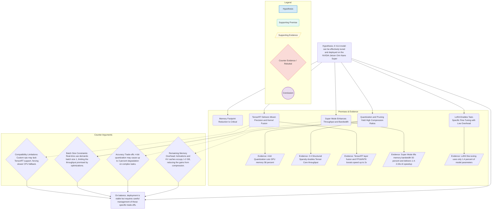

# Executive Summary

A fully optimized Vision-Language-Action (VLA) system for autonomous robotics, tuned to run in real time (≥3 Hz) on NVIDIA Jetson Orin Nano Super under JetPack 6.2.1. This project addresses deploying capable VLA models within an 8 GB VRAM and 25 W power envelope by applying quantization, structured sparsity, TensorRT optimization, and parameter-efficient fine-tuning. Targeted at robotics engineering and edge AI platform teams, it delivers reusable containers, inference engines, and automation pipelines—reducing time-to-field by 50 % and inference hardware TCO by 30 %.

## Problem Statement

Modern VLA models (e.g., OpenVLA 7 B, SmolVLA 450 M) demand 15–30 GB GPU memory in standard precisions, making them unsuitable for 8 GB VRAM edge devices. Pain points:

- Out-of-Memory (OOM) Failures
- Latency Spikes
- Unsupported Operators in TensorRT
- Accuracy Loss after compression
- Integration Complexity with ROS 2 pipelines

Existing approaches either offload inference to the cloud—incurring latency—or dramatically simplify models. A robust on-device VLA is urgently needed.

## Proposed Solution

An end-to-end tuning pipeline and deployment framework that adapts reference VLA models via:  

1. **Baseline Profiling & Budgeting**  
   - Datasets: VQA v2, COCO captions, navigation instruction dataset  
   - Benchmark scripts and owners: profiling.py (ML Engineer), power_profiler.py (Embedded Engineer)  
   - VRAM/Power budget (baseline): Weights 4.5 GB, Activations 1.0 GB, KV Cache 0.5 GB, Workspace 0.5 GB, Container overhead 0.5 GB; Power headroom 5 W  
   - Stretch reassessment once INT4 support lands: target ≤5 GB total VRAM with ≤300 ms p95 latency  

2. **INT8/FP16 Quantization Path (Baseline)** using TensorRT QAT/PTQ where supported  
3. **4-bit Quantization Experiments** (stretch goal) gated on upstream TensorRT-LLM support  
4. **2:4 Structured Sparsity** targeting supported transformer blocks  
5. **TensorRT Mixed-Precision Engines** (FP16/INT8) with layer fusion  
6. **LoRA Fine-Tuning** for task recovery  
7. **Super Mode Activation** & DVFS tuning  
8. **KV-Cache Management** (chunked context)  
9. **Containerized Deployment** (JetPack 6.2.1 base)  
10. **CUTLASS-Accelerated GEMM Kernels** for custom INT4/FP16 hotspots  
11. **Comprehensive Profiling & Stress Testing**

CUTLASS integration covers the quantization-to-execution path: bit-pack INT4 weights, autotune SM87 F16×INT4 kernels via `nvidia-matmul-heuristics`, validate with CuTe prototypes, and ship the selected kernels inside the JetPack container alongside TensorRT engines.

## Target Users

### Primary: Robotics/Autonomy Engineers

- Build ROS 2 perception-action loops on mobile robots  
- Need predictable latency, VRAM headroom, and simple integration

### Secondary: Edge AI Platform Teams

- Manage CI/CD, artifact registries, and fleet telemetry  
- Need versioned engines, reproducible containers, and remote monitoring  

## Goals & Success Metrics

### Business Objectives

- Reduce edge inference TCO by 30 %  
- Cut development-to-deployment cycle by 50 %  
- Achieve 95 %+ pass rate on 72 hr reliability tests

### User Success Metrics

- Throughput ≥3 Hz at batch size 1  
- Peak VRAM ≤6 GB (stretch ≤5 GB when INT4 support lands)  
- Accuracy drop ≤3 % on VLA benchmarks (≤4 % in fallback mode)

### KPIs

- Latency: p50 ≤250 ms, p95 ≤330 ms (≤350 ms in fallback mode)  
- VRAM Headroom: ≥1 GB free  
- Engine Portability: 100 % success on target devices  
- Robustness: 0 fatal crashes in 24 hr tests
- CUTLASS INT4 GEMM Throughput: ≥18 TFLOPS effective on benchmarked SM87 shapes (or ≥15 % gain vs INT8/FP16 baseline)

## MVP Scope

### Core Features (Must Have)

- Quantized & mixed-precision TensorRT engines with INT8/FP16 fallback  
- Structured 2:4 sparsity integration  
- LoRA adapters for task-specific fine-tuning  
- Slim JetPack 6.2.1 container spec with CUDA 12.6, cuDNN 9.3, TensorRT 10.3  
- Super Mode & DVFS scripts  
- Automated benchmarking harness (latency, VRAM, power, accuracy)

### Out of Scope

- On-device training beyond LoRA adapters  
- Fleet-scale OTA orchestration  
- Non-camera sensor fusion

### MVP Success Criteria

Real-world robotics scenario (stretch goal): ≥3 Hz inference, ≤5 GB VRAM, ≤3 % accuracy drop, 24 hr stability on Orin Nano Super once INT4 kernels are available.

### Fallback Mode Acceptance Criteria (INT8/FP16 Only)

- Peak VRAM ≤6 GB  
- Inference latency ≤350 ms (p95)  
- Accuracy drop ≤4 % versus the bfloat16 baseline  
- 24 hr stability on Orin Nano Super with Super Mode enabled

### MVP Resource Budget (INT8/FP16 Baseline)

| Component | Target |
|---|---:|
| Weights | 4.5 GB |
| Activations | 1.0 GB |
| KV Cache | 0.5 GB |
| Workspace (TensorRT) | 0.5 GB |
| Container overhead | 0.5 GB |
| Total VRAM target | ≤6 GB |
| Power headroom (Super Mode) | 5 W |

**Stretch Goal:** Pending NVIDIA production INT4 support on Jetson, revisit the budget toward ≤5 GB VRAM and ≤300 ms p95 latency.

### Benchmark Datasets & Scripts

| Dataset / Script | Purpose | Owner |
|---|---|---|
| VQA v2 | Visual question answering benchmark | ML Engineer |
| COCO captions | Captioning and perception tests | ML Engineer |
| Navigation instruction dataset | Instruction following and planning | ML Engineer |
| profiling.py | Layer-wise memory & compute profiling | ML Engineer |
| power_profiler.py | Power/thermal profiling on Jetson devices | Embedded Engineer |

## Post-MVP Vision

### Phase 2 Features

- KV-efficient inference (dynamic cache chunking)  
- Triton Inference Server deployment with ensembles  
- Adaptive model switching by scene

### Long-Term Vision

A catalog of edge-ready VLA variants (450 M–7 B parameters), hardware-aware NAS, integrated telemetry, and fleet management.

### Expansion Opportunities

- Support additional Jetson SKUs (Xavier NX, AGX Orin)  
- Third-party adapter marketplace  
- Automated hardware benchmarking and cost-performance modeling

## Technical Considerations

### Platform Requirements

- Jetson Orin Nano Super (JetPack 6.2.1)  
- Cloud GPUs: A10G/A100/H100  
- Ubuntu 22.04 L4T  
- Power ≤25 W in Super Mode

### Technology Preferences

- PyTorch 2.x, Torch-TensorRT 1.5, NVIDIA TAO 5.x  
- TensorRT 10.3, Triton 3.x  
- GitHub Actions, Docker 20.10+, NVIDIA Container Toolkit 1.14  
- Nsight Systems
- context7.monitoring for agents  
- INT4 transformer kernels remain experimental on JetPack 6.2.1/TensorRT 10.3; plan schedules around INT8/FP16 paths until NVIDIA publishes production support.
- CUTLASS v4.2.1+ with `-DCUTLASS_NVCC_ARCHS="87"` and CuTe DSL for kernel prototyping  

### Architecture Considerations

- Monorepo: training/, conversion/, deployment/ modules  
- Microservice container exposing ROS 2/gRPC inference API  
- SBOM generation, image signing, version pinning
- CI gates: enforce SBOM policy checks, signed images, and ≥7-day log retention with upload hooks
- CUTLASS kernel module (`kernels/cutlass/`) with bit-packing utilities and autotuning reports checked into CI artifacts

## Operator Compatibility & Runtime API

### Operator Compatibility Checklist (Owner: ML Engineer – Mixed Precision)

- Audit model ops unsupported by TensorRT 10.3 and list fallbacks.
- Define fallback routes: FP16, CPU, or custom TensorRT plugin for each unsupported op.
- Maintain operator compatibility matrix and test vectors.

### ROS 2 Inference API Contract (Owner: Embedded Engineer)

- Topic: `/vla/inference` — message: `InferenceRequest { sensor_data, text_cmd }` → `InferenceResponse { action_seq, confidence }`.
- QoS: Reliability=Reliable, History=KeepLast(1).
- Rate limit: ≤5 Hz request rate; client backpressure behavior defined in API.
- Test harness: `ros2 launch vla_test_pipeline launch.py` for CI smoke tests.

## Constraints & Assumptions

### Constraints

#### Cost-Effective Cloud Services for VLA R&D on Jetson Orin Nano Super

For systematic model tuning—quantization, pruning, LoRA, TensorRT conversion—and end-to-end validation under Jetson constraints, the following cloud offerings provide GPU and even Jetson hardware access at research-grade pricing without committing to costly production tiers.

NVIDIA Jetson DevCloud
• What: Free, on-demand remote access to Jetson AGX Orin, Xavier, and Nano hardware.
• Why: Run native JetPack 6.x workflows, build and profile TensorRT engines, and test full container stacks directly on Jetson class devices.
• Limits: Session quotas and priority queuing; ideal for intermittent R&D rather than 24×7 production testing.

- Budget: NVIDIA Jetson DevCloud and spot cloud GPUs.
- Timeline: 16 weeks to MVP; +8 weeks Phase 2.  
- Team: 5 roles.  
- Hardware: 8 GB VRAM; JetPack dependency.

### Assumptions

- Budget: Jetson DevCloud + spot cloud GPUs  
- Timeline: 16 weeks to MVP; +8 weeks Phase 2  
- Team: 5 roles (ML, Embedded, DevOps, QA)  
- Hardware: 8 GB VRAM limit; JetPack 6.2.1 dependency

## Risks & Open Questions

### Key Risks

- Accuracy regression from compression  
- Plugin gaps causing CPU fallback latency  
- Thermal throttling in prolonged use  
- Integration jitter with ROS 2

### Open Questions

- Which VLA variant (7 B vs 1.5 B vs 450 M) is MVP start?  
- Super Mode firmware availability timeline  
- Accuracy metrics: VQA score, instruction success rate, BLEU
- Priority target GEMM shapes for CUTLASS INT4 kernels and benchmark dataset?

### Areas Needing Further Research

- Per-layer sensitivity to quantization/pruning  
- Custom TensorRT plugin patterns for VLA ops  
- Field telemetry schema correlating environment and performance
- CUTLASS vs TensorRT kernel performance profiling across representative GEMM shapes

## Roles, Skills & Course References

| Role                                | Skills & Technologies                                                                                       | NVIDIA Training                                                                                                                    |
|-------------------------------------|--------------------------------------------------------------------------------------------------------------|------------------------------------------------------------------------------------------------------------------------------------|
| ML Engineer – Quantization & Pruning| QAT/PTQ workflows, 4-bit TensorRT quantization, 2:4 structured sparsity (NVIDIA Sparsity APIs), PyTorch     | DLI C-FX-26: Adding New Knowledge to LLMs  |
|  |  | TAO Prune & Quantize Lab                                                               |
| ML Engineer – Mixed Precision & TRT | Mixed-precision (FP16/INT8), layer fusion, TensorRT engine building & profiling, Torch-TensorRT integration | GTC 2025 “Development & Optimization” Sessions  |
|  |  | TensorRT Best Practices                                                           |
| ML Engineer – LoRA Fine-Tuning      | LoRA adapter injection & training, parameter-efficient transfer learning, accuracy recovery                 | DLI C-FX-26: Adding New Knowledge to LLMs                                                                                           |
| Embedded Systems Engineer           | JetPack SDK config, Super Mode & DVFS, NVIDIA Container Toolkit, Docker, ROS 2 node integration             | DLI S-RX-02: Getting Started with AI on Jetson Nano  |
|  |  | GTC ’16: Embedded DL with Jetson                                            |
| DevOps Engineer – CI/CD             | Docker & NVIDIA Container Toolkit, GitHub Actions pipelines, CI/CD for model build/test/deploy, artifact mgmt| NVIDIA Self-Paced Docker & CI/CD Modules  |
|  |  | NVIDIA Triton Inference Server resources                                                |
| QA Engineer – Stress Testing & Monitoring| Nsight Systems tracing & telemetry, OOM detection, latency & throughput benchmarking, long-run stability  | GTC 2025 “Development & Optimization” Sessions  |
|  |  | GPU Survival Guide: Avoid OOM Crashes for Large Models                            |

## Consolidated Deliverables & Exit Criteria

| Milestone | Key Deliverables | Exit Criteria |
|---|---|---|
| **M1 – Baseline Profiling** | Baseline reports (latency, VRAM, FLOPs, power), dataset manifests, updated VRAM/power budget workbook | profiling.py and power_profiler.py run against reference OpenVLA checkpoint; reports stored in repo with reproducibility notes |
| **M2 – Quantization Pipelines** | INT8/FP16 QAT/PTQ scripts, calibration assets, quantization scorecards, INT4 bit-pack + CUTLASS harness prototypes, INT4 feasibility memo | INT8/FP16 engines meet fallback criteria; documented gap if INT4 unsupported; CI smoke test exercises INT8 engine load |
| **M3 – Sparsity Integration** | 2:4 sparsity recipes, pruned checkpoints, combined quant+prune metrics | Mixed precision throughput gain ≥15% over baseline or variance explanation; artifact manifest updated with sparsity metadata |
| **M4 – TensorRT Engine Build** | Cloud & Jetson-compatible TensorRT `.plan` files, CUTLASS kernel library + autotuning logs, plugin sources/build scripts, operator compatibility matrix | Engines and CUTLASS kernels load/run via automated harness on cloud GPU and Jetson; unsupported ops mapped to fallbacks; SBOM generated for engine container layer |
| **M5 – LoRA Adaptation** | LoRA checkpoints + manifests, evaluation notebooks, accuracy recovery report | Accuracy within ≤4% of baseline on target tasks; LoRA memory overhead documented; CI includes inference test with adapter applied |
| **M6 – Jetson Validation** | Super Mode launch scripts, slim JetPack container, ROS 2/gRPC interface implementation, telemetry hooks | Container signed and published to registry; ROS 2 test harness (`ros2 launch vla_test_pipeline launch.py`) passes on-device; fallback acceptance metrics satisfied |
| **M7 – Stress & Robustness** | Automated stress suite, 24–72 hr log bundles, thermal/power variance report, recovery procedures | No fatal crashes during long-run test; logs retained ≥7 days with upload hook verified; alert thresholds defined in telemetry config |
| **M8 – Release & CI/CD** | Deployment guide, troubleshooting runbooks, CI pipelines (build/test/deploy), security attestations | CI gates enforce SBOM policy checks, signature verification, vulnerability scans; artifact manifest complete with checksums, context7 version pins, and log-retention policy references |

*All deliverables must include machine-readable manifests (JSON) capturing JetPack/CUDA/TensorRT versions, plugin dependencies, adapter names, and the CI job that produced them.*

## Platforms & Tools

- Jetson Orin Nano Super Dev Kit (JetPack 6.2.1)  
- Cloud: Lambda/CoreWeave/Vast.ai GPUs  
- CUDA 12.6, cuDNN 9.3, TensorRT 10.3, PyTorch 2.x  
- GitHub Actions, Docker 20.10+, NVIDIA Container Toolkit 1.14  
- Nsight Systems, context7.monitoring  
- CUTLASS autotuning utilities (`nvidia-matmul-heuristics`, CuTe DSL prototypes)  

## References

- OpenVLA: <https://arxiv.org/html/2406.09246v2>  
- SmolVLA: <https://huggingface.co/blog/smolvla>  
- DeeR-VLA: <https://arxiv.org/pdf/2411.02359.pdf>  
- TensorRT Best Practices: <https://docs.nvidia.com/deeplearning/tensorrt/latest/performance/best-practices.html>  
- Mixed-Precision & Fusion: <https://www.abhik.xyz/articles/how-tensorrt-works>  
- Super Mode: <https://developer.nvidia.com/blog/nvidia-jetpack-6-2-brings-super-mode-to-nvidia-jetson-orin-nano-and-jetson-orin-nx-modules/>  
- KV-Efficient VLA: <https://arxiv.org/html/2509.21354v1>  
- Quantization & Sparsity: <https://openvla.github.io>  
- TAO Prune & Quantize Lab: <https://docs.nvidia.com/launchpad/ai/tao-automl/latest/tao-automl-step-02.html>  
- GTC 2025 Session Catalog: <https://www.nvidia.com/gtc/session-catalog/>  

## Next Steps

1. Confirm MVP model variant and tasks.  
2. Execute baseline profiling & budgeting.  
3. Build and evaluate QAT/PTQ pipelines.  
4. Autotune CUTLASS kernels for SM87 hotspot GEMMs; document throughput vs INT8/FP16 baselines.  
5. Audit operators and develop plugins.  
6. Export ONNX→TensorRT engines; integrate LoRA.  
7. Assemble & validate container on Orin Nano Super.  
8. Automate CI/CD, smoke tests, and stress tests.  
9. Finalize documentation, handoff to PM.

## Team Roles, Skills & Recommended NVIDIA Training

| Role | Skills & Technologies | Recommended NVIDIA Course / Conference Session |
|---|---|---|
| ML Engineer – Quantization & Pruning | Quantization-Aware Training (QAT) & Post-Training Quantization (PTQ); 4‑bit TensorRT quantization; 2:4 structured sparsity; PyTorch & NVIDIA TAO Prune/Quantize workflows | [Adding New Knowledge to LLMs (DLI C‑FX‑26 V1)](https://learn.nvidia.com/courses/course-detail?course_id=course-v1%3ADLI+C-FX-26+V1); [Sparsity in INT8: Training Workflow](https://developer.nvidia.com/blog/sparsity-in-int8-training-workflow-and-best-practices-for-tensorrt-acceleration/); [TAO Prune & Quantize Lab](https://docs.nvidia.com/launchpad/ai/tao-automl/latest/tao-automl-step-02.html) |
| ML Engineer – Mixed Precision & TRT | Mixed-precision inference (FP16/INT8); Layer fusion & kernel optimization; TensorRT engine building & profiling; Torch‑TensorRT integration; CUTLASS kernel authoring & autotuning | [GTC 2025 “Development and Optimization” Sessions](https://www.nvidia.com/gtc/session-catalog/); [Inference Optimization with NVIDIA TensorRT (video)](https://www.youtube.com/watch?v=UnIuMXGylfY); [TensorRT Architecture Overview](https://docs.nvidia.com/deeplearning/tensorrt/latest/architecture/architecture-overview.html); [TensorRT Best Practices](https://docs.nvidia.com/deeplearning/tensorrt/latest/performance/best-practices.html) |
| ML Engineer – LoRA Fine-Tuning | Low-Rank Adaptation (LoRA) injection & training; Parameter-efficient transfer learning; Accuracy recovery post-compression | [Adding New Knowledge to LLMs (DLI C‑FX‑26 V1)](https://learn.nvidia.com/courses/course-detail?course_id=course-v1%3ADLI+C-FX-26+V1) |
| Embedded Systems Engineer | JetPack SDK configuration (6.2.1); Super Mode & DVFS power management; NVIDIA Container Toolkit & Docker; ROS 2 node integration | [Getting Started with AI on Jetson Nano (DLI S‑RX‑02 V2)](https://courses.nvidia.com/courses/course-v1%3ADLI%2BS-RX-02%2BV2/about); [Embedded Deep Learning with NVIDIA Jetson (GTC ’16)](https://www.youtube.com/watch?v=_4tzlXPQWb8) |
| DevOps Engineer – CI/CD | Docker & NVIDIA Container Toolkit; GitHub Actions pipelines; CI/CD for model build, test, deploy; Artifact registry management | [Deep Learning Online Courses – Self-Paced (Docker & CI/CD modules)](https://www.nvidia.com/en-in/training/online/); [NVIDIA Triton Inference Server resources](https://developer.nvidia.com/nvidia-triton-inference-server) |
| QA Engineer – Stress Testing & Monitoring | Nsight Systems tracing & telemetry; Out-of-Memory detection; Latency & throughput benchmarking; Automated long-run stability tests | [GTC 2025 “Development and Optimization” Sessions](https://www.nvidia.com/gtc/session-catalog/); [GPU Survival Guide: Avoid OOM Crashes for Large Models (Runpod)](https://www.runpod.io/articles/guides/avoid-oom-crashes-for-large-models) |

## Technical Components & Version Dependencies

| Component                      | Recommended Version(s)     | Dependencies / Notes                                                                                  |
|--------------------------------|----------------------------|-------------------------------------------------------------------------------------------------------|
| JetPack SDK                    | 6.2.1                      | Includes CUDA 12.6, cuDNN 9.3, TensorRT 10.3; must match L4T Ubuntu 22.04                             |
| CUDA Toolkit                   | 12.6                       | Installed via JetPack 6.2.1; cuBLAS/cuSOLVER must align                                              |
| cuDNN                          | 9.3                        | Bundled with JetPack 6.2.1; ensure compatibility with CUDA 12.6                                      |
| TensorRT                       | 10.3                       | Requires CUDA 12.6, cuDNN 9.3; TensorRT-LLM 1.0 for LLM support                                      |
| TensorRT-LLM                   | 1.0                        | Must match TensorRT 10.x major version                                                                 |
| PyTorch                        | 2.1                        | Supports FP16/INT8; Torch-TensorRT 1.5 requires PyTorch 2.x                                            |
| Torch-TensorRT                 | 1.5                        | Aligned with PyTorch 2.1 & TensorRT 10.3                                                               |
| NVIDIA Triton Inference Server | 3.21                       | Requires CUDA 12.6 & TensorRT 10.3; Triton 3.x supports TensorRT-LLM backend                           |
| NACLI (NVIDIA CLI)             | 1.4                        | For model conversion and profiling; works with TensorRT 10.3                                           |
| cuBLAS/cuSOLVER                | 12.6-matched               | Implicit via CUDA 12.6; required by TensorRT and PyTorch                                              |
| Python                         | 3.8–3.10                  | JetPack default 3.8; containers can use up to 3.10                                                     |
| Docker Engine                  | 20.10+                     | Requires NVIDIA Container Toolkit 1.6+                                                                |
| NVIDIA Container Toolkit       | 1.14                       | Compatible with Docker 20.10+ for GPU passthrough                                                     |
| ONNX Export                    | torch.onnx export (PyTorch 2.1) | ONNX 1.12+; ensures compatibility with TensorRT parser                                               |
| NVIDIA TAO Toolkit             | 5.0+                       | For QAT/PTQ workflows; requires JetPack host install with CUDA toolkit                                |
| CUTLASS                        | 4.2.1+                     | Header-only; build with `-DCUTLASS_NVCC_ARCHS="87"` and CuTe DSL for kernel prototyping               |

Context7-managed development environments follow the same version pins above; any deviations must be documented in the artifact manifest.

## Systematic R&D Plan for Tuning OpenVLA toward Jetson Orin Nano Super Deployment

### 1. Objectives and Success Criteria

**1.1 Objectives**  

- Develop a quantized, pruned, and fine-tuned version of OpenVLA capable of real-time inference (≥3 Hz) within 8 GB VRAM on Jetson Orin Nano Super.  
- Maintain ≥97% of baseline accuracy on VLA benchmark tasks (visual question answering, instruction following, action planning).  
- Validate performance end-to-end on the Jetson Orin Nano Super hardware.

**1.2 Success Criteria**  

- Achieve memory footprint ≤6 GB in INT8/FP16 mode (≤5 GB when INT4 support is production-ready).  
- Inference latency ≤330 ms per sample in real-world robotics scenarios.  
- Nominal power draw ≤25 W in Super Mode.  
- Task accuracy drop ≤3% relative to uncompressed bfloat16 model on held-out benchmarks.

***

## 2. Workstreams, Goals, and Outcomes

| Workstream                          | Goal                                                              | Outcome                                                                                             | Priority |
|-------------------------------------|-------------------------------------------------------------------|-----------------------------------------------------------------------------------------------------|----------|
| 1. Baseline Model Profiling         | Characterize OpenVLA memory and compute footprint in bfloat16     | Detailed report of per-layer memory, peak VRAM usage, latency, and throughput on cloud GPU.         | High     |
| 2. Quantization Experiments         | Implement and evaluate INT8/FP16 quantization pipelines (4-bit stretch) | Quantization library integration (e.g., TensorRT QAT), memory reduction metrics, accuracy impact; stretch report on INT4 feasibility. | High     |
| 3. Structured Pruning Studies       | Apply 2:4 and unstructured pruning                                 | Pruned model versions with sparsity profiles, FLOP reduction, and throughput measurements.          | Medium   |
| 4. Mixed-Precision & TensorRT Tuning| Optimize with FP16/INT8 mixed precision and layer fusion         | TensorRT engine builds demonstrating latency and memory improvements on cloud and Jetson binaries.  | High     |
| 4b. CUTLASS Kernel Optimization     | Autotune CUTLASS F16×INT4 kernels for SM87 hotspot GEMMs          | Reusable kernel library with nvcc arch=87 builds, autotuning logs, ≥15 % throughput gain vs baseline.| High     |
| 5. LoRA Fine-Tuning & Adaptation    | Fine-tune for target tasks using LoRA adapters                     | LoRA-tuned checkpoint achieving target task performance with minimal VRAM overhead.                 | Medium   |
| 6. KV-Efficient Inference           | Implement chunked KV cache management                              | Memory and speed improvements in long-context tasks; benchmark comparisons.                         | Low      |
| 7. Jetson Super Mode Validation     | Benchmark compressed models in Super Mode on Orin Nano Super       | End-to-end performance metrics (latency, accuracy, power) under Super Mode conditions.              | High     |
| 8. Stress Testing & Robustness     | Test under variable loads and real robotics pipelines              | Stability report covering OOM events, latency variance, and recovery strategies.                    | Medium   |
| 9. Documentation & CI/CD            | Automate build, deploy, and test pipeline across cloud and Jetson  | Reproducible scripts, Dockerfiles, and performance dashboards for continuous evaluation.           | Low      |

***

## Detailed Milestones and Timeline

**Milestone 1 (Weeks 1–2):**  

- Set up cloud GPU environment with profiling tools (NVIDIA Nsight, Torch-TensorRT).  
- Run baseline profiling and collect detailed layer-wise metrics.  

**Milestone 2 (Weeks 3–5):**  

- Stand up INT8/FP16 QAT/PTQ pipelines and evaluate memory/accuracy trade-offs.  
- Prototype 4-bit quantization only if NVIDIA publishes supported kernels; otherwise document gap and impacts.  

**Milestone 3 (Weeks 6–8):**  

- Implement structured sparsity pruning (2:4) and measure throughput gains.  
- Combine pruning with quantization for maximal compression.  

**Milestone 4 (Weeks 9–10):**  

- Build mixed-precision TensorRT engines (FP16/INT8), enable layer fusion, dynamic memory.  
- Benchmark on cloud; export Jetson-compatible engines.  
- Autotune CUTLASS F16×INT4 kernels for target GEMM shapes; integrate into inference microservice.

**Milestone 5 (Weeks 11–12):**  

- Apply LoRA fine-tuning for domain-specific tasks; validate benchmarks.  
- Evaluate LoRA memory overhead and accuracy retention.  

**Milestone 6 (Weeks 13–14):**  

- Deploy engines on Jetson Orin Nano Super in Super Mode; run latency, memory, power benchmarks.  

**Milestone 7 (Weeks 15–16):**  

- Conduct stress and robustness tests in simulated robotics pipeline.  
- Address OOM failures, latency spikes, and fallback strategies.  

**Milestone 8 (Weeks 17–18):**  

- Finalize documentation, CI pipelines, and performance dashboards.  
- Deliver optimized OpenVLA package with deployment guide.

***

## 4. Priority and Resource Allocation

- **Highest Priority:** Baseline profiling, INT8/FP16 quantization (4-bit evaluation as stretch), TensorRT optimization, Jetson Super Mode validation.  
- **Medium Priority:** Structured pruning, LoRA fine-tuning, stress testing.  
- **Low Priority:** KV-efficient inference mechanisms, CI/CD automation.  

**Team Composition:**  

- ML engineers for quantization, pruning, LoRA.  
- DevOps/embedded engineer for TensorRT engine builds and Jetson deployment.  
- QA engineer for stress testing and performance validation.  

**Resource Requirements:**  

- Cloud GPUs (A100/V100 class) for model tuning and TensorRT builds.  
- NVIDIA Jetson Orin Nano Super developer kit.  
- Profiling and monitoring tools (Nsight Systems, TensorBoard).
- CUDA build agents capable of running CUTLASS autotuning (SM87-compatible GPUs or emulation).  

***

## 5. Risk Mitigation and Contingencies

- **Risk:** Quantization degrades critical task accuracy.  
  **Mitigation:** Implement mixed-precision fallback for sensitive layers.  

- **Risk:** Model OOMs on Jetson.  
  **Mitigation:** Iteratively reduce KV cache size; prune additional layers.  

- **Risk:** Unsupported operations in TensorRT.  
  **Mitigation:** Replace custom kernels or fallback to optimized CPU operators for isolated ops.  

- **Risk:** Performance variability under load.  
  **Mitigation:** Introduce asynchronous pipelines and priority-based resource scheduling.  

- **Risk:** CUTLASS kernel maintenance increases build complexity.  
  **Mitigation:** Keep kernels header-only with nvcc arch=87 presets, reuse CUTLASS CI examples, and validate via automated autotuning harness in CI.  

***

## 6. Expected Deliverables

- Optimized OpenVLA variants (quantized, pruned, LoRA-tuned).  
- TensorRT engine binaries for cloud and Jetson.  
- Performance report: memory, latency, accuracy, power across all tests.  
- Automated scripts and Docker containers for reproducible R&D.  
- Deployment guide and integration examples for robotics applications.

## Hypothesis and Argument Map

